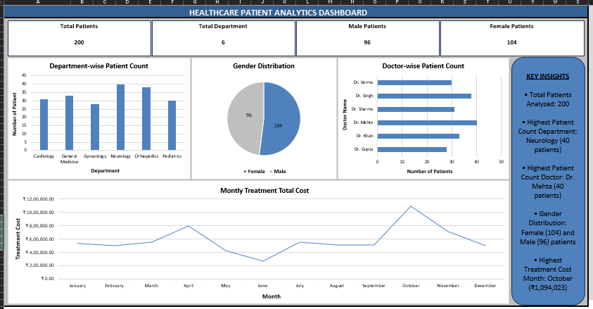

# 🏥 Healthcare Data Analysis Dashboard (Microsoft Excel)

## 📌 Project Overview
This project demonstrates how Microsoft Excel can be used to analyze healthcare data and build an interactive dashboard. The dashboard provides insights into patient distribution, department performance, doctor-wise patient count, gender distribution, and monthly treatment costs.

## 🎯 Objective
To analyze healthcare data using Microsoft Excel and create an interactive dashboard for better decision-making.

## 🛠️ Tools & Features Used
- Microsoft Excel
- Pivot Tables
- Pivot Charts
- COUNTIF
- VLOOKUP
- Conditional Formatting
- Slicers

## 📊 Dashboard Preview

> *(Add the Dashboard.png image here after uploading it to the repository.)*

## 📈 Key Insights
- Total Patients: **200**
- Total Departments: **6**
- Neurology recorded the highest patient count (**40 patients**).
- Dr. Mehta treated the highest number of patients (**40 patients**).
- Female patients (**104**) were slightly more than male patients (**96**).
- October recorded the highest treatment cost.

## 📂 Repository Files
- `Healthcare_Dashboard.xlsx` – Excel dashboard project
- `Project_Report.pdf` – Project documentation
- `Dashboard.png` – Dashboard screenshot

## 🚀 Skills Demonstrated
- Data Cleaning
- Data Analysis
- Dashboard Design
- Data Visualization
- Excel Formulas
- Reporting

## 👩‍💻 Author
**Ashima Pradhan**

If you found this project useful, feel free to ⭐ this repository.
